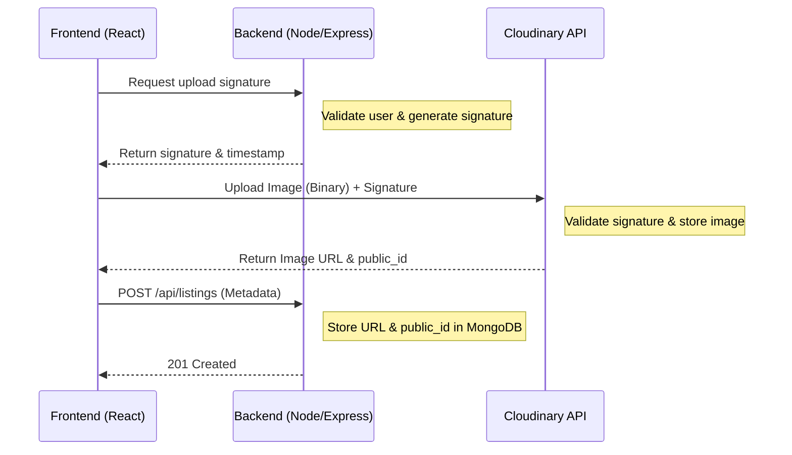

# Cloudinary Signature-Based Upload Flow

This document outlines the secure process for uploading images from the CampusHub frontend directly to Cloudinary, ensuring our backend never has to handle large binary files.

## High-Level Flow



## Step-by-Step Implementation

### 1. Backend: Generate Signature
The server uses the `cloudinary` SDK to generate a signature using our `API_SECRET`.
- **Endpoint**: `GET /api/upload/sign`
- **Logic**: 
  ```javascript
  const timestamp = Math.round(new Date().getTime() / 1000);
  const signature = cloudinary.utils.api_sign_request({
    timestamp: timestamp,
    folder: 'listings'
  }, process.env.CLOUDINARY_API_SECRET);
  ```

### 2. Frontend: Direct Upload
The frontend uses the signature to upload directly to the Cloudinary endpoint.
- **Endpoint**: `https://api.cloudinary.com/v1_1/${cloudName}/image/upload`
- **FormData**:
  - `file`: The image file.
  - `api_key`: Our public API Key.
  - `timestamp`: The same timestamp from the backend.
  - `signature`: The signature from the backend.
  - `folder`: 'listings'.

### 3. Backend: Store Metadata
Once Cloudinary returns the results, the frontend sends the `secure_url` and `public_id` to our API.
- **Model Storage**:
  ```javascript
  images: [
    {
      url: "https://res.cloudinary.com/...",
      public_id: "listings/abc123xyz"
    }
  ]
  ```

## Security Benefits
- **No Server Load**: Large uploads don't consume our backend bandwidth or memory.
- **Secure**: Only authenticated users can request a signature, and the signature is short-lived.
- **Automatic Optimization**: Cloudinary handles resizing, cropping, and format conversion.
